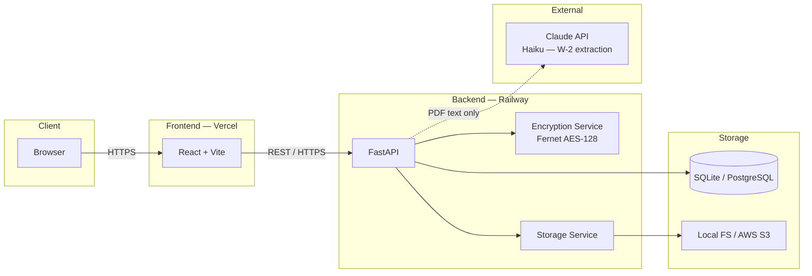

# Client Intake and Document Collection Tool
### Built by Shreyash Thakare


A secure tool for CPA firms to collect client tax information and documents. Clients log in, fill their own intake form, upload their W-2s and other documents, and submit directly to their CPA. CPAs review what the client submitted, add notes, and mark the return complete. Firm leadership gets a read-only dashboard across every CPA and every submission.

Live demo: https://tdip.vercel.app

---

## Demo Accounts

All passwords are `password123`.

| Role | Email | What you can do |
|---|---|---|
| Admin (firm leadership) | admin@sdt.com | View all intakes across all CPAs. Read-only. |
| CPA — Sarah Miller | sarah@sdt.com | Manage John Doe, Emily Rodriguez, Michael Chen, Alex Smith |
| CPA — James Carter | james@sdt.com | Manage Robert Kim, Priya Patel |
| Client — Alex Smith | alex.smith@client.com | Fill own tax form, upload documents, submit to CPA |

---

## Run Locally

You need Python 3.10+ and Node.js 18+.

**1. Clone the repo**
```
git clone https://github.com/Shreyash606/TDIP.git
cd TDIP
```

**2. Set up the backend**
```
cd backend
python -m pip install -r requirements.txt
```

Create `backend/.env`:
```
DATABASE_URL=sqlite:///./taxdoc.db
SECRET_KEY=change-this-in-production
STORAGE_TYPE=local
LOCAL_STORAGE_PATH=./uploads
FIELD_ENCRYPTION_KEY=<generate below>
```

Generate an encryption key:
```
python -c "from cryptography.fernet import Fernet; print(Fernet.generate_key().decode())"
```

Start the server:
```
python -m uvicorn app.main:app --reload --port 5001
```

**3. Load demo data**

In a second terminal inside `backend/`:
```
python fresh_seed.py
```

This wipes the database and loads demo data: 5 CPA-managed intakes across two CPAs, plus one client self-service account (Alex Smith). SSN and bank fields are encrypted in the database using the key you set above.

**4. Set up the frontend**
```
cd frontend
npm install
npm run dev
```

**5. Open the app**

Go to http://localhost:5173 and log in with any demo account above.

---

## What You Can See

**As Alex Smith (Client):**
- Client portal with a single card: "My Tax Return"
- Fill in personal info, income sources, deductions, bank details
- Upload documents (W-2, 1099s, etc.) with category labels
- Submit to CPA — form locks after submission

**As Sarah (CPA):**
- John Doe — complete intake, married filing jointly, W-2 and 1099s
- Emily Rodriguez — in progress, single filer, educator
- Michael Chen — complete, restaurant owner with rental property
- Alex Smith — submitted by client, shows purple "Client Submitted" badge

**As Admin:**
- All intakes across both CPAs
- Full SSN visible (admins need it for compliance review)
- Bank numbers shown as "On file (restricted)"
- Consent status and timestamp for each intake

---

## Single CPA Assumption

The current system auto-assigns every new client to the first active CPA in the database. This works for a single-CPA firm but does not distribute load as the firm grows.

**How to scale to multiple CPAs:**

| Strategy | When to use |
|---|---|
| Round Robin | Assign new clients in rotation — simple, fair |
| Workload-based | Assign to the CPA with the fewest open intakes |
| Manual assignment | Admin picks the CPA at registration |
| Specialization | Route based on client type (freelancer, business owner, etc.) |

The data model already supports all of these — `clients.cpa_id` is the only thing that changes.

---

## Architecture



**Client → Vercel (React)** — static SPA, no secrets, no data.
**Vercel → Railway (FastAPI)** — every call authenticated with JWT Bearer token.
**FastAPI → DB** — SSN and bank fields Fernet-encrypted before every write.
**FastAPI → S3** — files stored with AES-256 enforced in the API call, no public URLs.
**FastAPI → Claude** — only extracted PDF text is sent, never PII.

See [`docs/decisions/`](docs/decisions/) for the reasoning behind each architectural choice.

---

## Security at a Glance

- **Passwords** — bcrypt hashed, never stored in plain text
- **SSN and bank fields** — Fernet encrypted in the database
- **Files** — served through authenticated endpoints only, no public URLs
- **Login** — rate-limited to 5 attempts per minute per IP
- **Access** — CPAs can only see their own clients, enforced at the database level
- **Audit log** — every file upload and download is logged with user, timestamp, and IP
- **Consent** — §7216 consent checkbox is required and timestamped on every intake

---

## Project Layout

```
backend/
  app/
    main.py                 Server entry point, security headers middleware
    models.py               Database tables
    auth.py                 JWT tokens, role enforcement
    limiter.py              Rate limiting setup
    config.py               Environment variable definitions
    routes/
      auth.py               Login and register (rate-limited)
      intake.py             Intake CRUD, file upload, file download, audit logging
      clients.py            Client management
    services/
      encryption_service.py Fernet field-level encryption
      storage_service.py    Local and S3 file storage
  fresh_seed.py             Wipes DB and loads demo data (encrypted)
  requirements.txt

frontend/
  src/
    components/
      Home.jsx              Landing page, role-based navigation
      ClientIntakeForm.jsx  Client self-service intake form
      IntakeDashboard.jsx   CPA intake list
      IntakeReviewPanel.jsx CPA review form with masked sensitive fields
      CreateIntakeModal.jsx New intake modal
      Register.jsx          Client / CPA / Admin registration
    contexts/
      AuthContext.jsx       JWT token management
    services/
      api.js                All backend calls
```

---

## Environment Variables

```
DATABASE_URL          sqlite:///./taxdoc.db  (swap to PostgreSQL URL for prod)
SECRET_KEY            Signs JWT tokens — change in production
STORAGE_TYPE          local or s3
LOCAL_STORAGE_PATH    ./uploads
FIELD_ENCRYPTION_KEY  Fernet key — required for encrypted SSN and bank fields
AWS_ACCESS_KEY_ID     S3 mode only
AWS_SECRET_ACCESS_KEY S3 mode only
AWS_S3_BUCKET         S3 mode only
```

---

## Deployed

- Frontend: https://tdip.vercel.app
- Backend: https://courageous-beauty-production-6d0f.up.railway.app

Auto-deploys from `main` on GitHub push.

---

## Documentation

| Document | Description |
|---|---|
| [SECURITY.md](SECURITY.md) | Vulnerability reporting and known security limitations |
| [CHANGELOG.md](CHANGELOG.md) | Version history following Keep a Changelog |
| [docs/decisions/](docs/decisions/) | Architecture Decision Records — why each key choice was made |
